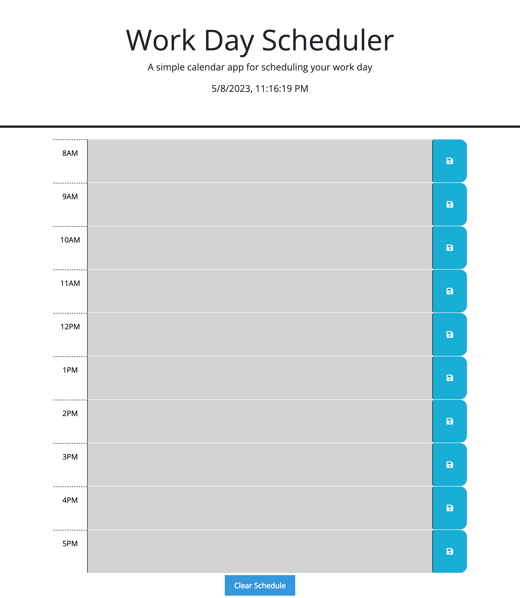

# 📅 WorkDayCalendar

Welcome to WorkDayCalendar, a web page that helps you create and manage your daily schedule! This page is designed using HTML, CSS, and JavaScript to provide you with a seamless and easy-to-use interface.

## 🚀 Features

- Current Time and Auto-Update: The page shows the current date and time at the top of the page. The time is updated every minute using JavaScript to ensure that you always have the most accurate information.
- Daily Schedule: The page displays the hours of the workday (8 AM to 6 PM) and provides a space to write notes for each hour. The colors of each hour block change depending on the current time, with the present hour block colored red, future hour blocks colored green, and past hour blocks colored gray.
- Saving and Clearing Schedule: Each hour block has a save button that can be clicked to save the notes for that hour to local storage. There is also a "Clear Schedule" button that clears all saved notes from local storage and resets the schedule.

## 🛠️ Technologies Used

This page is built using:

- HTML: Hypertext Markup Language is used to structure content on the web page.
- CSS: Cascading Style Sheets is used for styling the web page elements.
- JavaScript: Used for implementing the page's functionality and interaction.
- jQuery: A JavaScript library used to simplify JavaScript programming.

## 🚀 Getting Started

To get started with WorkDayCalendar, simply open the index.html file in your browser. The page will load and display the current date and time at the top of the page, and the daily schedule with hour blocks and save buttons.

## 📝 License

This project is licensed under the MIT license. See the `LICENSE` file for more details.

### Screenshot

### Link to deployed website
[Website Link](https://riskthatbiscuit.github.io/WorkDayCalendar/)